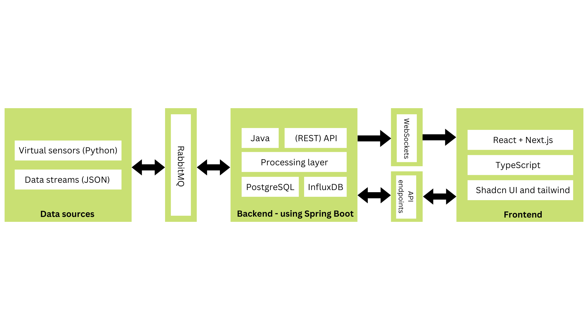

# SmartHomes


Project for "Introdução à Engenharia de Software", 2023/2024

## Description

The SmartHomes application is designed to **address the problem of efficient and
sustainable home resources management**. Therefore, it provides a solution for homeowners
to monitor and control their electricity and water. This solution is made for it to work in all
and any devices plugged into the house (unlike HomeKit), as it is not dependent on the
devices but on the physical interfaces they are plugged into.

This kind of set up also prevents complex programming skills or automation skills from the
user (like it may happen in other cases like Google Home). Adding various functions from
other mainstream applications, such as smart device control and control and info about
household resources. Instead of merely controlling devices, we gain insights into how to
intelligently assist the environment and your wallet.

## UI

Login                      |  Home insight             | Home Overview
:-------------------------:|:-------------------------:|:-------------------------:
| | 

Enviromental                      |  Electricity           | Water
:-------------------------:|:-------------------------:|:-------------------------:
|| 

Devices                      |  Costs           | Settings
:-------------------------:|:-------------------------:|:-------------------------:
||


## Usage
### One time usage
```
$ docker compose up -build

```

### More then once
```
$ docker compose down --volumes
$ docker builder prune -all 
$ docker compose up -build
```

## Architecture
### Module interactions



## Rest API Documentation (swagger)

The SmartHomes App API has various entities (house, devices,...) and functions to each one of them. To see more details go to:
[/api/docs/index.html](http://localhost/api/docs/index.html)

## Personas and scenarios mail and passwords
### Ana
email: ana@ua.pt</br>
password: anaanaana
### John
email: john@ua.pt</br>
password: johnjohn
### Petter
email: peter@ua.pt</br>
password: petterpetter

### Contributors
- 68264: Bruno Lopes => Team Manager
- 108712: Diogo Falcão => Architect
- 108011: Fábio Matias => Product Owner
- 107927: Rúben Garrido => DevOps master
